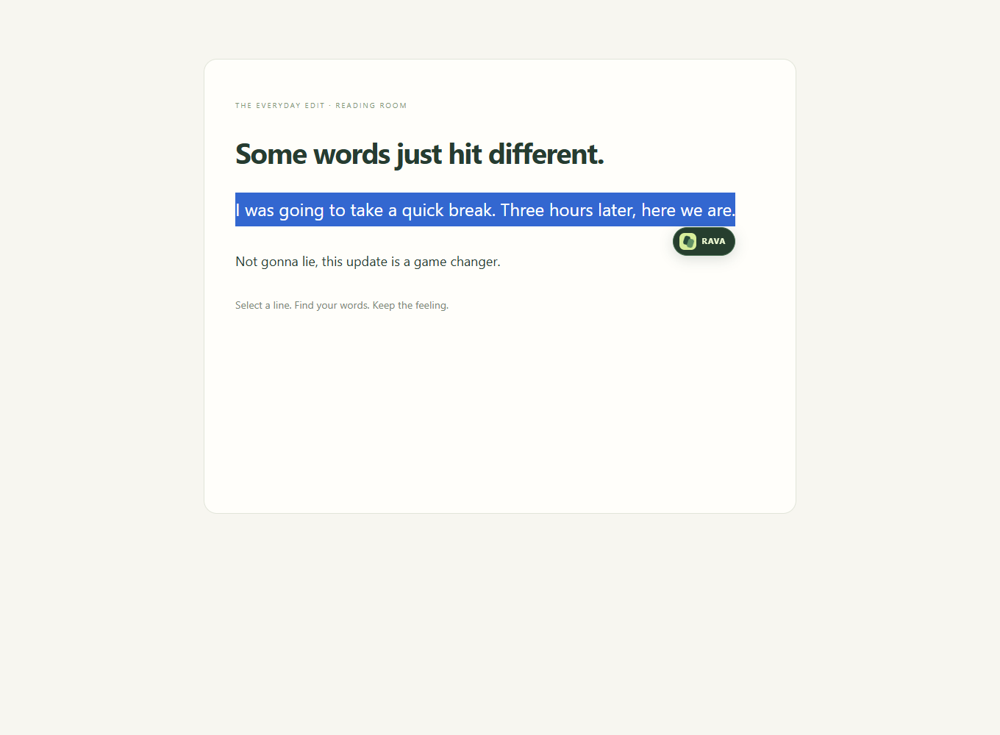
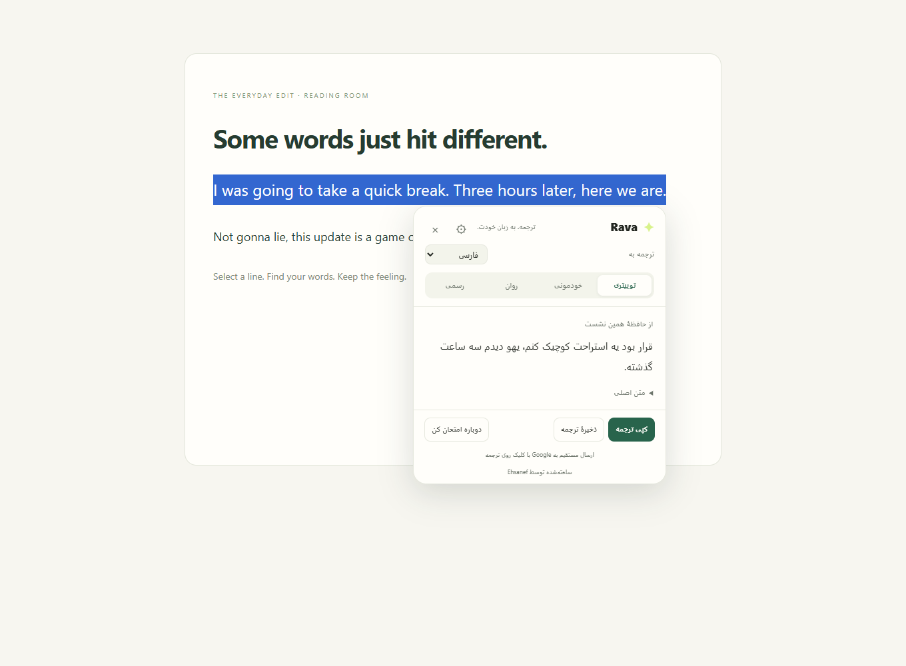

# Rava

**Translation. In your voice.**

Made by **[Ehsanef](https://github.com/ehsanef)** · Chrome extension · Gemini API

[راهنمای فارسی](README.fa.md) · [Updating an existing installation](UPDATE-fa.md)

Rava turns selected text into a natural translation without leaving the page. Select a word, sentence, or paragraph; the **RAVA** button appears beside it. Click once to open the translation, switch its tone, and copy the result.

**Default model: `gemini-3.7-flash`.** Bring your own Google AI Studio API key. No build step or intermediary server is required.



## Features

| Feature | What it does |
| --- | --- |
| Automatic selection button | Shows RAVA beside text selected with the mouse or keyboard. |
| In-page translation | Opens a compact popup on the current page, with no new translation tab. |
| Four voices | Social, Casual, Natural, and Formal translations. |
| Social / Twitter-style Persian | Encourages idiomatic, conversational Persian while preserving meaning, humor, and sarcasm; no forced hashtags or emoji. |
| Custom style instructions | Add preferences such as “keep technical terms in English.” |
| 14 target languages | Persian, English, Arabic, Turkish, French, German, Spanish, Russian, Japanese, Korean, Simplified Chinese, Hindi, Portuguese, and Italian. |
| Automatic source language | Gemini detects the source language from the selected text. |
| One-click copy | Copy the translated text directly from the popup. |
| Saved translations | Explicitly save favorites on your device and delete them whenever you want. |
| Keyboard and context menu | Use `Alt + Shift + T` or right-click selected text to translate. |
| Quick translate | Paste text into the extension's toolbar popup. |
| Persian and English UI | Full RTL/LTR support, with Light, Dark, and System appearance. |
| Real connection test | Retrieves available text models, then translates a short sample using the same API path as normal translations. |
| Model selection | Starts with Gemini 3.7 Flash; lets you choose another available text model or a faster Flash-Lite option. |
| Cancel and cache | Cancel pending requests and reuse recent results from a temporary session cache. |
| Per-site pause | Disable the selection button for individual hostnames. |
| Clear errors | Distinguishes quota, key, model, service, location, billing, timeout, and unreadable-response failures. |



## Install in Chrome

1. Download this repository using **Code → Download ZIP** and extract it, or clone it.
2. Open `chrome://extensions` in desktop Chrome.
3. Enable **Developer mode**.
4. Click **Load unpacked** and select the folder containing `manifest.json`.
5. Pin Rava from Chrome's extensions menu.
6. Refresh existing website tabs so the selection button can appear.

Rava is installed locally as an unpacked extension. It is not currently published in the Chrome Web Store. Keep its folder in place after installation.

## Connect your Gemini key

1. Create an API key in [Google AI Studio](https://aistudio.google.com/apikey).
2. Open Rava's settings and enter your key.
3. Leave the default `gemini-3.7-flash`, or choose an available text model.
4. Click **Test translation & save key**. This translates “Hello! How are you?” and uses one API generation request. A successful model-list request alone is not reported as a successful translation.
5. Select text on a website and click **RAVA**.

API access, quotas, model availability, and billing belong to your own Google account. If the configured model is unavailable in your model list, the connection check selects an available text model and displays its name in settings.

## Choose a voice

- **Social:** punchy and conversational, suited to posts and memes, without turning the translation into an unrelated rewrite.
- **Casual:** everyday language, like talking to a friend.
- **Natural:** fluent, neutral phrasing that stays faithful to the source.
- **Formal:** precise, professional wording for work and formal writing.

Names, facts, numbers, links, handles, existing emoji, and the author's intended meaning are preserved in the prompt. Translation quality still depends on the source text and model.

## Privacy

- Selecting text does **not** send an API translation request. Translation begins only after you click or invoke the shortcut/context-menu action.
- The requested text and translation/style instructions go directly to Google's Gemini API over HTTPS. Rava does not include the full webpage or its URL in translation requests.
- Keys remain in the extension's own storage, with access restricted to trusted extension contexts. They are not synced through Chrome and are not embedded in this repository.
- You choose whether the key persists on the device or is kept only for the current browser session. Persistent extension storage has no additional application-level encryption.
- There is no automatic permanent translation history. Only favorites you explicitly save are stored permanently on the device.
- The extension has no analytics, ads, or intermediary server. Google's handling of API requests is governed by its own terms and your account settings.

## Limits and troubleshooting

- Maximum source text per request: **12,000 characters**.
- Saved favorites: **100**. Temporary cache: up to **30 results** for **10 minutes**, possibly cleared earlier when Chrome stops the service worker.
- Chrome internal pages, the Chrome Web Store, the built-in PDF viewer, and local `file://` pages do not support the selection popup. Paste text into Rava's toolbar popup instead.
- Password inputs are excluded. Ordinary text inputs and textareas support selected text.
- Refresh the website after installing or reloading the extension.
- You can change the shortcut at `chrome://extensions/shortcuts`.
- When reporting a failure, include the visible error category and HTTP code, if shown. Do not include your API key or private source text.

## Development

The extension runs directly from its source files: no bundler, dependency install, or external UI library is required.

| File | Responsibility |
| --- | --- |
| `manifest.json` | Chrome Manifest V3 configuration. |
| `background.js` | Credentials, messaging, cache, favorites, and context-menu commands. |
| `api.js` | Shared Gemini HTTP/JSON client for translations and connection tests. |
| `core.js` | Defaults, validation, translation prompts, and localized strings. |
| `content.js` | Selection detection and the isolated in-page popup. |
| `popup.html`, `popup.js` | Toolbar popup. |
| `options.html`, `options.js` | Connection, preferences, and saved translations. |
| `ui.js`, `ui.css` | Shared interface behavior and styling. |

Run the dependency-free unit tests with Node.js 18 or newer:

```sh
npm test
# or
node --test tests/*.test.cjs
```

This version passed **17 unit/API tests** and **31 browser checks** in real Chrome using controlled provider responses. Browser checks included genuine mouse selection, clicking the RAVA button, in-page rendering, copying and pasting, cancellation, credential isolation, localization, and error states. Provider responses in automated checks and screenshots were simulated; these results do not establish live-account connectivity or live translation quality.

## Version 1.2.0

- Default Gemini model changed to **`gemini-3.7-flash`**.
- **Made by Ehsanef** is visible in the settings page, toolbar popup, and in-page translation popup.
- On an update from 1.1.0, the old default Flash-Lite setting is migrated to the new default. Other saved model choices are retained.
- Includes the 1.1 improvements: automatic RAVA selection button, standard HTTP/JSON translation, real connection testing, and more specific error messages.

---

**Rava — made by Ehsanef.**
